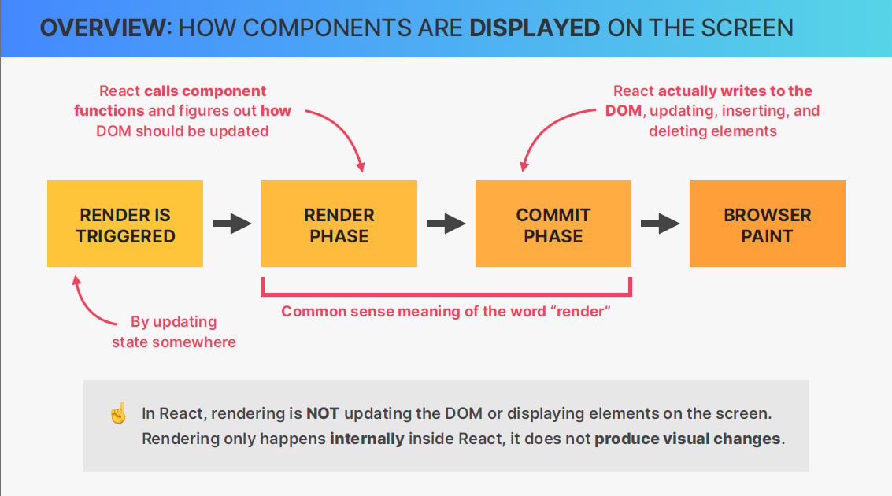
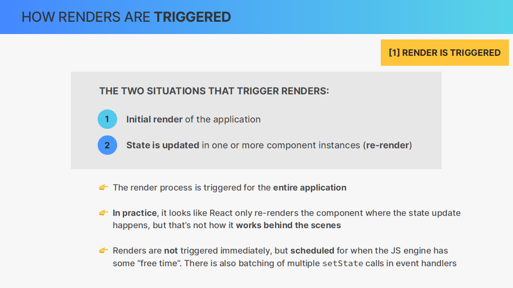
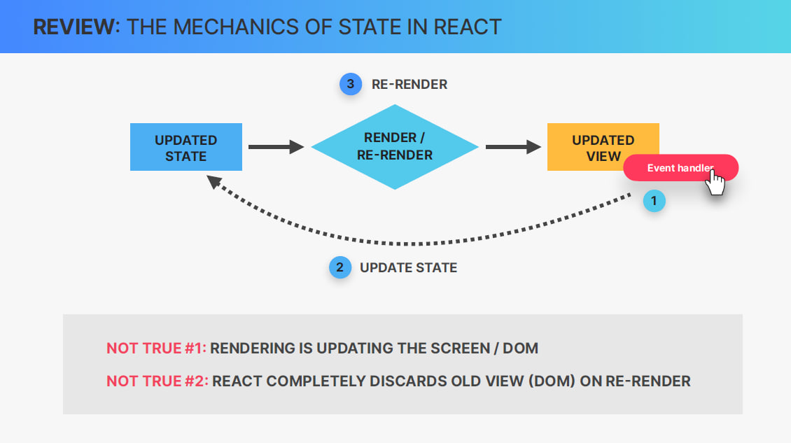
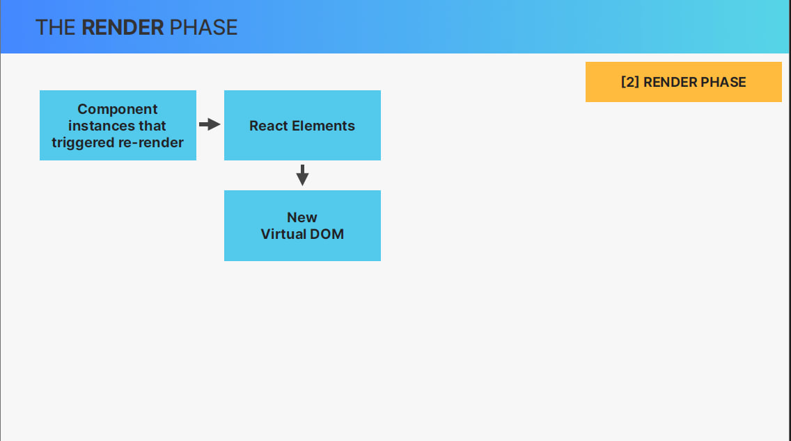
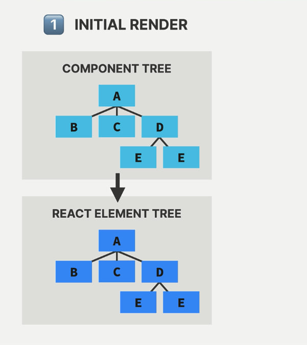
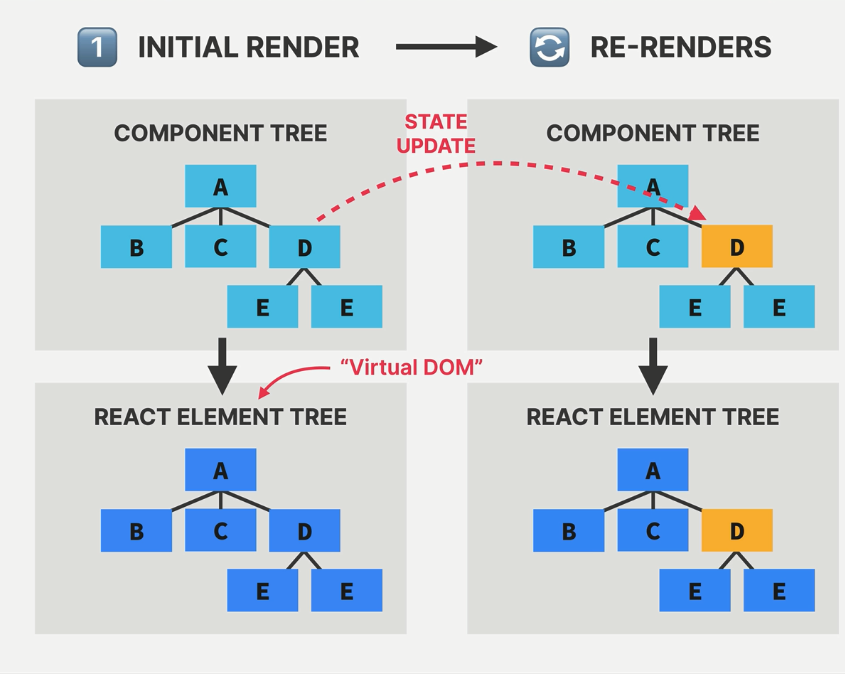
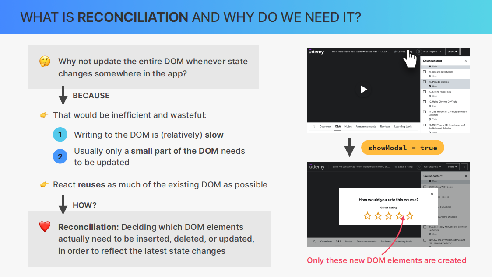

## overview: how components are displayed on the screen

هر باری که رندر شروع به کار میکنه  (Render is triggered) بیشتر وقت ها با آپدیت کردن state رخ میده پس تغییرات state باعث  رندر شدن میشه 
فاز بعدی ( Render Phase ) هستش تمام کامپونت ها صدا زده میشن و تصمیم میگیره که دام قراراه چه اپدیتی انجام بده یعنی بیاد اخرین تغییرات اعمال بکنه البته باید بدونیم ِDOM اپدیت نمیشه .تو این فاز در React، رندر به‌ معنای این نیست که  DOM در حال اپدیت شدن هست و یا اون المنت هارو نشون بده روی صفحه!
رندرینگ  در داخل React اتفاق می افتد، یعنی نمیتونیم به صورت ویژیوالی اون تغییرات ببینیم.
فاز بعدی و فاز رندر کردن به معنای رندر کردن و اپدیت شدن dom هستش 
وقت یریکت بدونه که قراره چجور یاپدیت بشه که اسم این فاز commit phase هستش  توی این المنت المنت های جدید توی دام قرار میگیرن و همچنین المنت هایی که از قبل وجود دارن هم ممکنه اپدیت بشن  درنهایت مرورگر متوجه میشه که dom اپدیت شده پس دوباره میاد نشون میده اون تغییرات رو

فاز اول :  Render is triggered 
دوبار یک اپلیکیشن میتونه شروع به رندر شدن بکنه اولین باری که کل اپ رندر شده برای اولین بار و دومین بار اینه که state مورد نظر اپدیت شده یا ری -ریندر اتفاق بیوفته
و اینو یادت باشه که برای یه کامپونت اتفاق نمیوفته برای کل دام یا کل اپ شروع به رندر شدن میشه 
 
وقتی یه چیزی نیاز داره نشون داده بشه یا رندر بشه توی صفحه ، به صورت مستقیم این عمل اتفاق نمیوفته. به جای اون صبر میکنه و برنامه ریزی میکنه وقتی جی اس انیجین سرش شلوغ نیست و همچنین یه لیستی باشه از اپدیت های مختلف و استیت های زیادی قراره اپدیت بشن اونجا  batched میشن و همه رو یه جا انجام میدن این کار باعث میشه کارها سریع تر و بهتر انجام بشن !
When something needs to be shown (or "rendered") on the screen, it doesn't happen right away. Instead, it waits for a good time when the computer isn't too busy. Also, if there are many small updates, they get grouped together and are done at the same time. This makes things work faster and smoother.
 

 
توی جلسات قبلی گفتیم که وقتی یه state  اپدیت میشه رندر میشه اون تغیرات و سپس ما اون تغییرات تو صفحه میبینیم ولی این کاملا اشتباهه ! رندر کردن به این معنا نیست که توی صفحه نشون داده بشه به این معناست که اون کامپونت فانکشن کال بشه و همینطور گفتیم که وقتی ری-رندر اتفاق میوفته اون ورژن قبلی حذف میشه این هم کاملا 
اشتباهه و به جاش یه ورژن جدید میاد
 

So, at the beginning of the render phase ,React will go through the entire component tree , take all the component instances that triggered a re-render
and actually render them, which simply means to call the corresponding component functions that we have written in our code. This will create updated React elements which altogether make up the so-called virtual DOM.

## The virtual dom (react element tree) ?
on the initial render, React will take the entire component tree and transform it into one big React element which will basically be a React element tree like this one And this is what we call the virtual DOM.

Virtual DOM: Tree of all React elements created from all instances in the component tree
(Virtual DOM: It's like a blueprint or sketch of your entire app, showing how it should look, made from all the parts you've created using React.)
Cheap and fast to create multiple trees. People often talk a lot about the "virtual DOM" when they explain React and how it works.

 let's now suppose that there is gonna be a state update in component D,which will of course trigger a re-render.That means that React will call the function of component D again and place the new React element in a new React element tree .So, in a new virtual DOM.

first when Component D is re-rendered 

When you update a part of your app, everything inside that part will also update, even if nothing changed in those inner parts. Rendering a component will cause all of its child components
to be rendered as well (no matter if props changed or not).

what happens next is that this new virtual DOM that was created  after the state update will get reconciled (it means that after the state (or data) of a component is updated, React will check and make sure that what you see on the screen matches this new state)  with the current so-called Fiber tree as it exists before the state update. Now this reconciliation is done in React's reconciler
which is called Fiber. Then the results of this reconciliation process is gonna be an updated Fiber tree,so a tree that will eventually be used to write to the DOM.

### what is reconciliation and why do we need it?
Why not update the entire DOM whenever state changes somewhere in the app?
we said that creating the virtual DOM so the React element tree for the entire app is cheap and fast because it's just a JavaScript object Well, writing to the DOM is not cheap and fast.

  - wasteful to always write the entire virtual DOM to the actual DOM each time that a render was triggered.Also, usually when the state changes somewhere in the app only a small portion of the DOM needs to be updated and the rest of the DOM  that is already present can be reused.

So imagine that you have a complex app like udemy.com  and when you click on some button there then showModal is set to true, which in turn will then trigger a modal to be shown. So in this situation, only the DOM elements for that modal need to be inserted into the DOM and the rest of the DOM should just stay the same And so that's what React tries to do.

React will try to be as efficient as possible by reusing as much of the existing DOM tree as possible.

how does React actually do that? How does it know what changed?
that's where a process called reconciliation comes into play.
 so reconciliation is basically deciding exactlywhich DOM elements need to be inserted, deleted or updated in order to reflect the latest state changes.

 
reconciliation is processed by a reconciler and we can say that the reconciler really is the engine of React. called Fiber

### what is Fiber :

